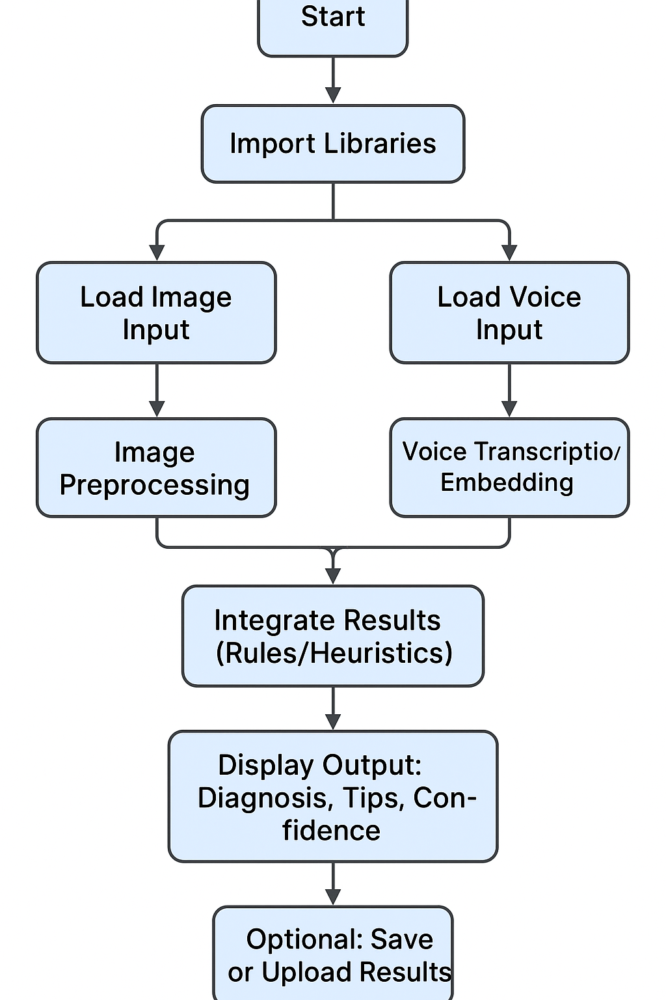
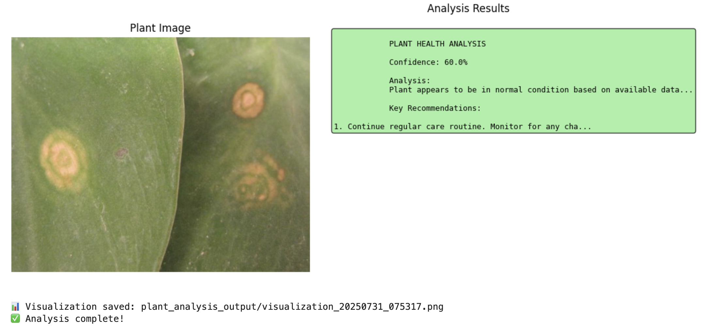

# 🌿 CropSenseAI - Clean AI Plant Health Advisor

CropSenseAI is an AI-powered plant health advisor that uses **image** and **voice input** to provide real-time predictions about plant conditions. This multimodal system combines vision models, audio processing, and rule-based knowledge to detect plant diseases, nutrient deficiencies, and pest infestations.

## 🗺️ Schematic Overview



> This diagram summarizes the project flow to health recommendations for your plants.

## 🚀 Features

- 🔍 **Image-based diagnosis** using advanced deep learning models.
- 🎤 **Voice input** to describe symptoms in natural language.
- 🤖 **Multimodal analysis** combining visual and auditory cues.
- 🧠 **Rule-based knowledge engine** for interpretability.
- 📦 Lightweight & deployable — avoids ONNX mobile conversion.
- 🧪 Works in Kaggle with GPU, supporting Unsloth + Transformers.

## 📁 Project Structure

```
CropSenseAI/
│
├── trap                  # Main Kaggle notebook (multimodal inference pipeline)
├── assets/               # Schematic diagram and any sample inputs
├── README.md             # This file
└── requirements.txt      # Package dependencies (optional)
```

## 🧬 Workflow

1. **User uploads an image** of a plant leaf or crop.
2. **Optional voice input** describing symptoms is processed via a transcription engine.
3. Image is analyzed by a vision model (e.g., EfficientNet or ViT).
4. Audio is processed by a speech model (e.g., Whisper or Wav2Vec).
5. Rule-based logic integrates results and gives a **diagnosis + recommendation**.


## 📦 Dependencies

- `transformers`
- `torch`
- `unsloth`
- `librosa`, `torchaudio`
- `PIL`, `matplotlib`, `opencv-python`
- Optional: `gradio`, `onnx`, `tensorflow`

## 🧠 Model Used

CropSenseAI uses:
- Vision encoder: CNN or Transformer-based classifier
- Audio encoder: Pre-trained speech model for transcription or classification
- Logic: Rule-based Python layer for interpretation

## 🖼️ Output

- Diagnosis class (e.g., "Powdery mildew", "Nitrogen deficiency")
- Confidence score
- Optional image annotation and treatment tips





## 🛠️ How to Run

This notebook is optimized for **Kaggle GPU** environment. Just upload the notebook and press "Run All". For local runs, make sure to install dependencies from `requirements.txt`.

## 📌 License

Open-source under MIT License.

## 🤝 Contributions

We welcome contributions. Please fork this repository, open an issue or a pull request.

## 📬 Contact

Created by Michel Nzikou – [michel.nzikoumamboukou@uwa.edu.au](mailto:michel.nzikoumamboukou@uwa.edu.au)
